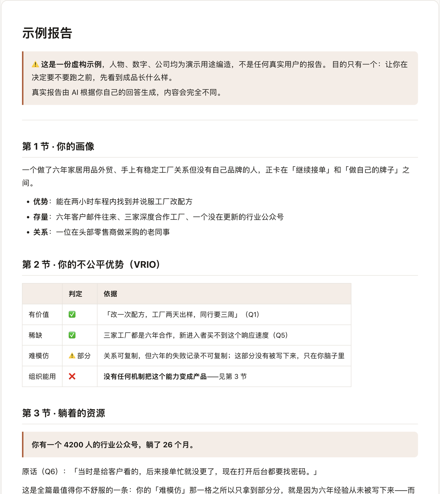
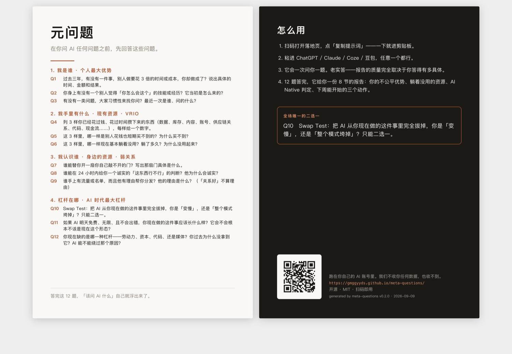

<!-- 生成物，勿手改。改 source/meta_questions.yaml 后跑 `python3 build.py` -->
<div align="center">


<h1>meta-questions</h1>

<p><b>在你问 AI 任何问题之前，先回答这些问题。</b></p>

<p><!--COUNT:questions-->12<!--/COUNT--> 个问题 · 摸清你的优势、资源与关系网 · 产出一份 AI Native 方向报告</p>

<p>
  <a href="https://github.com/gmggyyds/meta-questions/actions"></a>
  
  
  
</p>

<p>粘进任意 AI 聊天框就能跑 · 中英各一套 · 中英各一轮完整会话在 ChatGPT 上实跑验证过</p>

<p>
  <a href="https://gmggyyds.github.io/meta-questions/"><b>打开落地页复制提示词</b></a> ·
  <a href="https://gmggyyds.github.io/meta-questions/viewer.html?sample=1">看一份跑完的报告</a> ·
  <a href="https://github.com/gmggyyds/meta-questions/blob/main/README.en.md">English</a>
</p>

</div>

---

## 📦 装

不用装。没有依赖、没有 API key、没有账号——它就是一段提示词，跑在你自己的 AI 里。

<b>主路径</b>：打开 [落地页](https://gmggyyds.github.io/meta-questions/) → 点「复制提示词」→ 粘进 ChatGPT / Claude / 任意 AI 聊天框 → 老实回答。整段提示词内联在页面里，复制这一步不发任何网络请求。

<b>命令行拿提示词</b>：

```bash
curl -sL https://raw.githubusercontent.com/gmggyyds/meta-questions/main/dist/quickstart.md > quickstart.md
# 英文版把路径换成 dist/en/quickstart.md
```

<b>clone 下来自己挑档位</b>：

```bash
git clone https://github.com/gmggyyds/meta-questions
cd meta-questions
# 档 A 单文件：复制 dist/quickstart.md 全文，粘进任意 AI
# 档 B 分段 + 本地记忆：dist/staged/ 下 01 到 05 依次跑，结论写进你自己的 profile.md
```

<b>档 C 装成 Claude Code skill</b>：

```bash
git clone https://github.com/gmggyyds/meta-questions
cp -r meta-questions/.claude/skills/meta-questions ~/.claude/skills/
# 英文版目录是 .claude/skills/meta-questions-en
```

SKILL.md 的 frontmatter 自带触发词，装完在 Claude Code 里说「元问题」就能起。

到手之后你只用做一件事：一次一题，老实答。

## 🎯 它解决什么

你已经天天在用 AI 了，但它给你的东西，跟给别人的没两样。

你问「我该怎么用 AI 做点什么」，它回你做自媒体、搭个 Agent、做知识付费。一份对谁都成立的清单。对谁都成立，就等于对你没用。原因很直白：它不知道你手上有什么。

再往下一层，才是真正卡住的地方——<b>你自己也说不清你手上有什么</b>。

现在让你说三样你已经花过钱、花过时间攒下来的东西，你说得出的多半是「我人脉还行」「做了六年有点经验」。没有数字、没有人名、没有时间。这种描述你自己听着都虚，交给 AI 更是废的。所以问题不在提示词技巧，在于你从没被人逼着把底牌摊开数一遍。

这 12 个问题就干这一件事：逼你把底牌摊开。答完之后，「该问 AI 什么」自己会浮出来。

如果你是点进来想把它拿走改的人，那你多半也写过「让 AI 采访我」的提示词，也知道它会怎么坏：一上来把十几个问题全甩出来；你答得敷衍它就顺着敷衍，还夸你两句；没问到最后就迫不及待开始总结；让它找对标它凭记忆编公司名和 URL；把「仅供你判断」这种内部指令念给用户听。这个仓的价值不是那 12 个问题——是这些失败模式已经被真机跑出来，逐条钉死在一个 YAML 里了。

## 🔍 一题问出来的差距

下面这段对话是示例，不是真实会话记录。左右两边问的是同一道题（Q1）。

<table>
<tr><th width="50%">你随口答</th><th width="50%">被追问一次之后</th></tr>
<tr valign="top"><td>

> 我以前做过一个项目，比同行快很多，效果挺好的。

拿这句去问 AI，它只能回你一份通用清单——它无法从这句话里知道你到底强在哪。

</td><td>

> 上个月，我用 6 天做完一件外包报价六位数、工期六周的活，交付后返修零次。

同一个 AI，拿到这句话就能往下推：这是能力还是运气、能不能复制、值不值得做成产品。

</td></tr>
</table>

差别不在模型，在于第二句里有时间、有数字、有可比对象。追问器最多追两次；两次还追不到，报告里就写「证据不足」，不替你编。

## 📄 你会拿到什么

一份 8 节的报告：你的画像、你的不公平优势、躺着的资源、你的杠杆缺口、AI Native 判定、下周就能开始的三个动作、海外对标、你还没回答的问题。



最后一节叫 <b>「你还没回答的问题」</b>，是整套东西存在的理由。一个好的元问题，判据不是 AI 答得多漂亮，是你答完之后自己冒出了新问题。

想先看成品：[示例报告](https://gmggyyds.github.io/meta-questions/viewer.html?sample=1)（虚构人物，用来看格式）。

## ❓ 12 个问题

**1. 我是谁**　<sub>个人最大优势</sub>

- **Q1**　过去三年，有没有一件事，别人做要花 3 倍的时间或成本，你却做成了？说出具体的时间、金额和结果。
- **Q2**　你身上有没有一个别人觉得「你怎么会这个」的技能或经历？它当初是怎么来的？
- **Q3**　有没有一类问题，大家习惯性来找你问？最近一次是谁、问的什么？

**2. 我手里有什么**　<sub>现有资源 · VRIO</sub>

- **Q4**　列 3 样你已经花过钱、花过时间攒下来的东西（数据、库存、内容、账号、供应链关系、代码、现金流……），每样给一个数字。
- **Q5**　这 3 样里，哪一样是别人花钱也短期买不到的？为什么买不到？
- **Q6**　这 3 样里，哪一样现在基本躺着没用？躺了多久？为什么没用起来？

**3. 我认识谁**　<sub>身边的资源 · 弱关系</sub>

- **Q7**　谁能替你开一扇你自己敲不开的门？写出那扇门具体是什么。
- **Q8**　谁能在 24 小时内给你一个诚实的「这东西行不行」的判断？他为什么会诚实？
- **Q9**　谁手上有流量或名单，而且他有理由帮你分发？他的理由是什么？（「关系好」不算理由）

**4. 杠杆在哪**　<sub>AI 时代最大杠杆</sub>

- **Q10**　Swap Test：把 AI 从你现在做的这件事里完全拔掉，你是「变慢」，还是「整个模式垮掉」？只能二选一。
- **Q11**　如果 AI 明天免费、无限、且不会出错，你现在做的这件事应该长什么样？它会不会根本不该是现在这个形态？
- **Q12**　你现在缺的是哪一种杠杆——劳动力、资本、代码、还是媒体？你过去为什么没拿到它？AI 能不能绕过那个原因？

## 🪜 三档取用

| 档 | 用什么 | 给谁 | 记得住你吗 |
|---|---|---|---|
| A 单文件 | [dist/quickstart.md](https://github.com/gmggyyds/meta-questions/blob/main/dist/quickstart.md) | 所有人。复制粘贴就能跑 | 不记得 |
| B 分段 + 记忆 | [dist/staged/](https://github.com/gmggyyds/meta-questions/tree/main/dist/staged) | 想认真做一遍的人。profile.md 存你自己电脑上，下次接着聊 | 记得 |
| C Claude Code skill | [.claude/skills/meta-questions/](https://github.com/gmggyyds/meta-questions/tree/main/.claude/skills/meta-questions) | Claude Code 用户。能读写文件、能联网找对标 | 记得 |

英文版有档 A 和档 B（[dist/en/](https://github.com/gmggyyds/meta-questions/tree/main/dist/en)）与档 C（[.claude/skills/meta-questions-en/](https://github.com/gmggyyds/meta-questions/tree/main/.claude/skills/meta-questions-en)）。现场卡和现场讲稿只有中文版。

## 📚 这不是拍脑袋想的三个维度

| 维度 | 理论 | 出处 | |
|---|---|---|---|
| 三维模型整体 | Effectuation — Bird-in-Hand Principle: Who I am / What I know / Whom I know | Saras D. Sarasvathy, UVA Darden | [→](https://papers.ssrn.com/sol3/papers.cfm?abstract_id=1278404) |
| 个人最大优势 | Who I am — tastes, abilities, expertise | Sarasvathy, Effectuation | [→](https://www.darden.virginia.edu/effectuation) |
| 手里的现有资源 | RBV / VRIO — Valuable, Rare, Inimitable, Organized | Jay Barney, 1991 / 1995 | [→](https://strategicmanagementinsight.com/tools/vrio/) |
| 身边的资源 | The Strength of Weak Ties — of those who found a job through a personal contact, 55.6% saw that contact only occasionally | Mark Granovetter, 1973, AJS | [→](https://news.stanford.edu/stories/2023/07/strength-weak-ties) |
| AI 时代最大杠杆 | Four kinds of leverage — labour, capital, code, media. The last two are permissionless. | Naval Ravikant | [→](https://aydoo.services/en/articles/naval-ravikant-leverage/) |
| AI Native vs 旧业务+AI | The Swap Test — remove the AI: does the team slow down (enabled) or does the model collapse (native)? | CRV, The Founder's Guide to AI-Native, 2026 | [→](https://www.crv.com/content/what-is-ai-native) |
| 元问题方法本身 | Meta-prompting — ask the model what it needs to know, one question at a time, before it answers | Practitioner consensus | [→](https://whitebeardstrategies.com/blog/ask-ai-what-to-ask-ai-the-meta-prompting-advantage/) |
| 验收判据 | 元问题 = 能引起问题的问题；判据是答完之后你自己冒出了新问题 | 教育学定义 | [→](https://zhuanlan.zhihu.com/p/629895268) |

## 🚫 它不做什么

诚实一点，省得你浪费时间：

- <b>不替你做决定。</b> 它给的是判断依据和方向，不是「你应该去做 X」。
- <b>不联网的 AI 跑不了第 7 节（海外对标）。</b> 提示词里写了自检：没有检索能力就只写「未找到」，一个公司名都不许编。这是刻意的——凭记忆产出的 URL 幻觉率最高。
- <b>你答得敷衍，报告就是废的。</b> 追问最多两轮，追不到就标「证据不足」，不会替你编。
- <b>不收集任何数据。</b> 没有后端，没有账号，没有云端同步。你的答案不会离开你的电脑。好处是你可以放心写真实数字；代价是换台设备要自己带 profile.md。
- <b>不是提示词技巧教程。</b> 这里没有「10 个让 AI 更聪明的咒语」。

## 🧭 答完之后呢

报告躺在某个对话窗口里，两周后你自己都找不到。下次开新对话，AI 又完全不认识你。

[the-great-me](https://github.com/gmggyyds/the-great-me) 把这些答案变成一份存在你自己电脑上的账本：以后的笔记、会议纪要、工单标个题号就持续归位，AI 做判断前先读它。数据不离开你的机器。

## 🧾 现场卡和报告排版器

[dist/card.html](https://github.com/gmggyyds/meta-questions/blob/main/dist/card.html) 是一张 A5（148×210mm）双面卡，浏览器直接打印就是成品。正面 12 题，背面用法加一个指向落地页的二维码。



AI 给你的报告是 Markdown。[viewer/index.html](https://github.com/gmggyyds/meta-questions/blob/main/viewer/index.html) 把它排成能看、能打印、能存 PDF 的样子：单文件、零外部依赖、不联网，双击就能用，[线上版在这](https://gmggyyds.github.io/meta-questions/viewer.html)。

## 🧪 实测

都是在这个仓里跑出来的，命令写在右边，你可以自己复核。

| 事实 | 怎么核 |
|---|---|
| `build.py` 自报产出 21 个文件：中英各 9 个（单文件、分 5 段、profile 模板、skill、README），加上现场讲稿、落地页、现场卡各 1 个。另外还会把排版器复制一份进 `docs/`，那一份不计入 21 | `python3 build.py` |
| 运行时依赖 0 个；构建依赖只有 pyyaml、segno、pytest 三个 | `cat requirements.txt` |
| build 幂等：重跑一次，生成物零变化 | `python3 build.py && git diff --exit-code -- dist docs README.md README.en.md .claude/skills` |
| 回归测试 59 条全过（v0.2.0 快照，加测试会涨） | `python3 -m pytest tests/ -q` |
| 单文件提示词 8543 字节 / 162 行 | `wc dist/quickstart.md` |
| GitHub raw 拉下来的那一份与仓里的逐字节一致 | `diff <(curl -sL https://raw.githubusercontent.com/gmggyyds/meta-questions/main/dist/quickstart.md) dist/quickstart.md` |
| 排版器 202 行，不引任何 CDN、外链脚本或字体 | `wc -l viewer/index.html && pytest tests/ -k external -q` |
| 落地页把整段提示词内联进 HTML，「复制提示词」这一步不发网络请求 | `grep -c "fetch(" docs/index.html` |
| 真源 517 行 YAML，生成器 build.py 1228 行 | `wc -l source/meta_questions.yaml build.py` |
| 追问上限写死在真源里：每题最多 2 轮 | `grep -n max_rounds source/meta_questions.yaml` |

真机验证：中英各在 ChatGPT 上跑了一轮完整会话，验到 6 条护栏生效——第一轮只输出 Q1、追问器真的会打回、选择题不再被追数字、用户喊「跳过直接给报告」模型只是重问当前题、内部指令零泄漏、档 B 的报告出口 8 节齐全。同一轮抓出并修掉 2 个真问题：模型把网址藏在链接文字后面（报告存成纯文本就丢），以及英文 skill 的 frontmatter 手拼后 YAML 解析失败。这一轮的逐条记录在 commit `ed3966e` 的提交信息里。

## 🛠️ 改它

真源只有一个：[source/meta_questions.yaml](https://github.com/gmggyyds/meta-questions/blob/main/source/meta_questions.yaml)。12 个问题、追问规则、报告模板、UI 文案、skill 触发词，全在里面，中英对照由 `validate()` 强制，缺一半直接炸。

```bash
pip install -r requirements.txt
python3 build.py             # 改完真源后重生成全部产物
python3 -m pytest tests/ -q  # 回归测试
```

`dist/`、`docs/`、`README*.md`、`.claude/skills/` 全是生成物，手改会被下次 build 抹掉，CI 也会因为 `git diff --exit-code` 不干净而失败。

三个会绊住你的地方，先说在前面：

- <b>不装 segno 会直接报错退出。</b> 现场卡的二维码用它生成，刻意不做降级——降级会让装没装库产出不同的 card.html，更要命的是占位二维码可能被拿去印刷。
- <b>改完真源必须提交生成物。</b> CI 用 `git diff --exit-code` 守真源与产物同步，忘了跑 build 就会红。
- <b>README 正文目前还硬编码在 build.py 的 README_ZH / README_EN 模板里。</b> 这是已知的第二真源，尚未迁。在迁完之前，改 README 要改 build.py——手改这个文件不但会被 `python3 build.py` 抹掉，连 `pytest` 都会抹掉它，因为测试的 fixture 会先跑一次 build。

<details>
<summary>为什么这么设计</summary>

- <b>幂等</b>：输出只依赖真源，不依赖构建当天的日期。版本号和发布日手工维护，否则 CI 没法用 `git diff --exit-code` 守同步。
- <b>题号锚定 id</b>：显示编号由 `q7` 推出 7，不由列表位置推。重排 YAML 里的题目顺序不会静默打乱编号。
- <b>分发即分叉</b>：你复制走的是快照。每个生成物页脚都印版本号，报告页脚也印。报告出得不对，先看版本号——那是唯一能归因的东西。

</details>

## 💬 FAQ

<details>
<summary>要不要付费？要不要 API key？</summary>

都不要。这是一段提示词，跑在你已有的 AI 账号里。
</details>

<details>
<summary>可以用中文答吗？</summary>

可以。中英文各一套完整的提示词，用哪个都行，回答语言随你。
</details>

<details>
<summary>「元问题」是什么意思？</summary>

meta- 是「关于……的」。元问题就是关于问题的问题：你现在问 AI 的这个问题，本身是不是对的问题？教育学里的定义更直接——能引起问题的问题，判据是答完之后你自己冒出了新问题。所以报告最后一节是三个反问，不是三条结论。
</details>

<details>
<summary>我可以拿去改、拿去教课、拿去商用吗？</summary>

MIT，随便。改了之后建议把版本号一起改掉，不然事后没法归因。
</details>

## 📁 目录

```
source/meta_questions.yaml   唯一真源：12 题、追问规则、报告 8 节、理论出处、UI 文案，中英同文件
build.py                     生成器：真源进，21 个产物出。README 正文模板暂时也在这里
dist/quickstart.md           档 A：单文件提示词，复制粘贴就能跑
dist/staged/                 档 B：分 5 段跑，结论写进你自己的 profile.md
dist/card.html               A5 双面现场卡，浏览器直接打印
dist/stage_script.md         15 到 20 分钟的现场讲稿骨架（只有中文版）
dist/en/                     英文版的档 A 与档 B
.claude/skills/              档 C：Claude Code skill，中英各一个目录
viewer/index.html            报告排版器，单文件零依赖，双击可用（手写，不由 build 生成）
docs/                        GitHub Pages：落地页 + 排版器副本 + 示例报告
examples/sample_report.md    一份标注为虚构的示例报告
tests/test_build.py          回归测试，同时是这套东西的行为规格
requirements.txt             构建依赖三个：pyyaml、segno、pytest
```

## ⭐ 国民级精品

<b>AI 时代最大的瓶颈，是你自己。</b>

不是模型不够强。是它不认识你——不知道你手里有什么、你的判断是怎么下的、
你到底在哪一步反复拖累了它。

下面四个，每一个拆的都是你身上的一处卡点。

| | 你卡在哪 | 它做什么 |
|---|---|---|
| <b>meta-questions</b><br><sub>AI 时代的元问题 · 你在这儿</sub> | AI 给你的是人均答案，因为它不知道你手里有什么 | 12 个问题问出你的优势、资源、关系网。<b>适合你的，才是最好的</b> |
| <b>[the-great-me](https://github.com/gmggyyds/the-great-me)</b><br><sub>更伟大的自己</sub> | 每开一次新对话，AI 都从零重新认识你一遍 | 把你的判断沉成常驻画像，让每次沟通都比上一次更懂你一点 |
| <b>[xxoo](https://github.com/gmggyyds/xxoo)</b><br><sub>吸星大法</sub> | 你抄的那套方法论，是给<b>别人的</b>生意写的 | 逐环拿你的业务去对，把别人的化成你自己的 |
| <b>[agents-deep-insights](https://github.com/gmggyyds/agents-deep-insights)</b><br><sub>会话照妖镜</sub> | 你以为是 AI 不行，其实是你在同一个地方反复绊住它 | 扫出你到底在哪拖累了它 |

连起来是一条线：

```
问心   我是谁、我手里有什么         meta-questions
铸我   让 AI 每次都带着这个认知      the-great-me
吸星   把外面的东西化成我的          xxoo
明镜   回头看我到底卡在哪            agents-deep-insights
```

<b>适合自己的，才有无限可能。</b> 这四个没有一个是给你标准答案的——
它们只干一件事：<b>让 AI 从「认识人类」变成「认识你」。</b>

## 🏁 说到底

三句话：

- <b>对谁都成立的答案，对你没用。</b> AI 给你人均答案，不是它不行，是它不知道你手里有什么。
- <b>你自己也说不清你手里有什么。</b> 所以这 12 个问题一次只问一题、答得虚就打回，逼你把数字、人名、时间说出来。
- <b>这些规则不是想出来的，是跑出来的。</b> 甩全部问题、顺着你敷衍、提前总结、编 URL、念内部指令——每一条都在真机上犯过，然后被钉死在一个 YAML 里。

你手上已经有的那些东西，比你以为的值钱。只是从来没人逼你数一遍。

现在就去：[打开落地页](https://gmggyyds.github.io/meta-questions/)，复制，粘进你常用的那个 AI，老实答完 12 题。

<sub>MIT License · generated by meta-questions v0.2.0 · 2026-09-09</sub>
